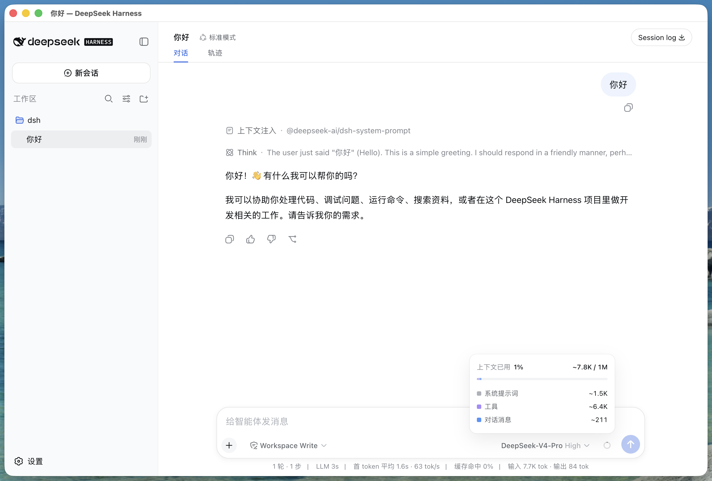
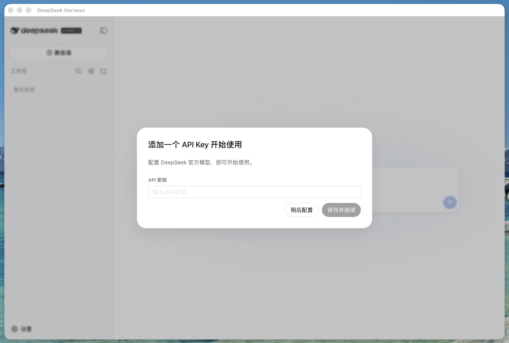
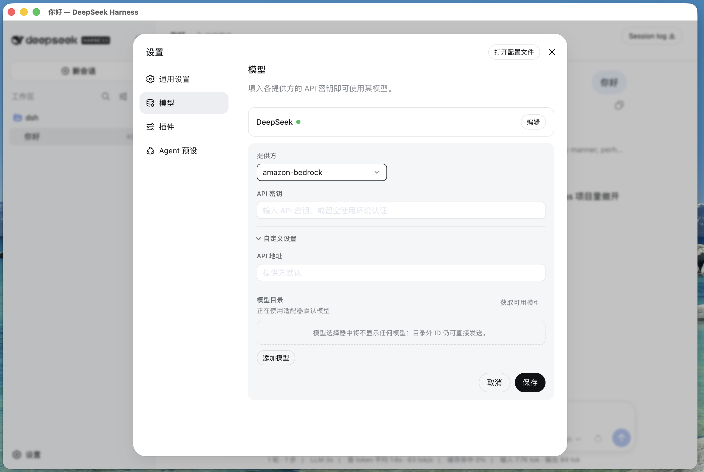
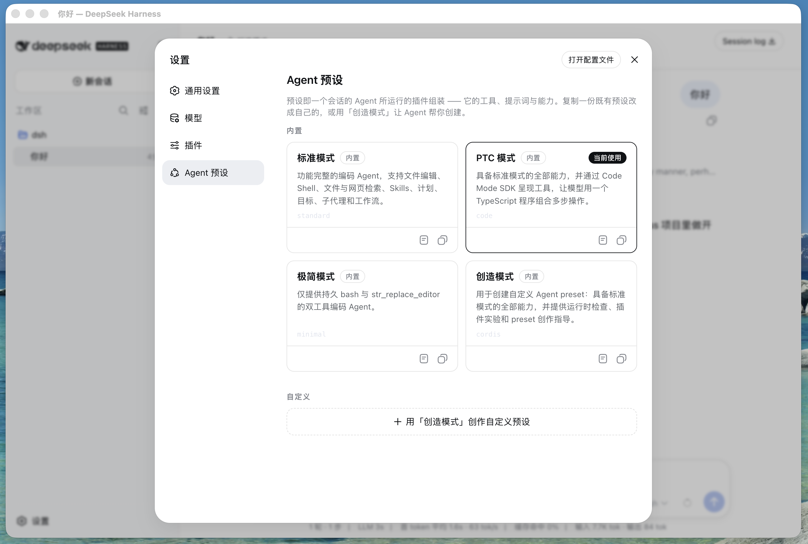
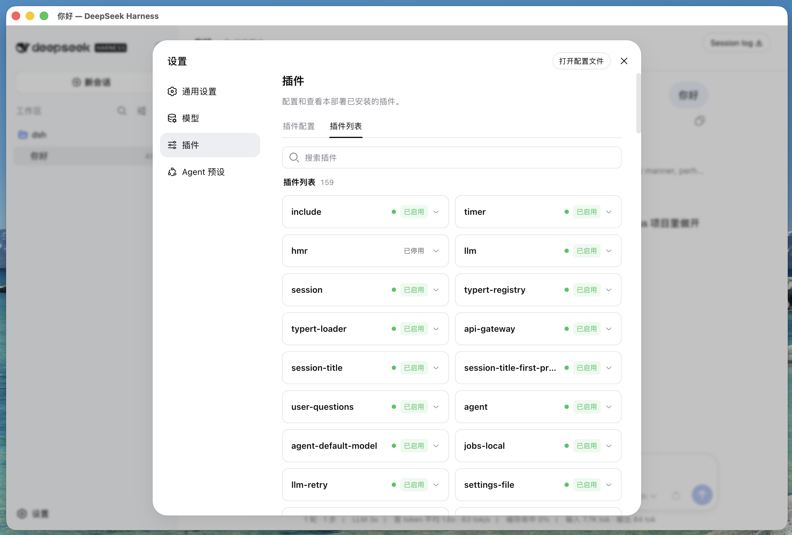

# DeepSeek Harness Desktop

DeepSeek Harness 的跨平台桌面版：在原生窗口中运行 dsh web 界面，而不是打开浏览器标签页。

[English](README.md) | 中文

## 特性

- 在原生窗口中使用 DeepSeek Harness 网页界面
- 运行时无需系统 Node.js（使用 Electron 内置的 Node）
- 服务器仅绑定回环地址，不对外暴露端口
- 支持 macOS（arm64 / x64）与 Windows（x64）
- 单实例锁，退出时干净关闭底层服务

## 界面预览

| 工作区 | API 密钥 | 模型 |
|:---:|:---:|:---:|
|  |  |  |

| Agent 预设 | MCP |
|:---:|:---:|
|  |  |

## 工作原理

Electron 主进程：

1. 解析已发布的 @deepseek-ai/dsh CLI（lib/bin.js）。
2. 使用 Electron 内置 Node（ELECTRON_RUN_AS_NODE）启动 "dsh web --port 0"。
3. 等待 "dsh web: http://127.0.0.1:PORT" 就绪行。
4. 在该 URL 上打开原生窗口，退出时停止服务。

## 环境要求

- Node.js ^22.19.0 或 >=24.0.0（仅构建时需要；打包后的应用自带运行时）
- macOS：Xcode 命令行工具
- Windows：Visual Studio Build Tools

## 开发

    npm install
    npm start

如需让桌面壳指向 Harness 的源码 checkout 而非 npm 包：

    DSH_CLI_BIN=/path/to/deepseek-harness/apps/cli/lib/bin.js npm start

该 checkout 需先构建：pnpm install && pnpm run build。

## 打包

    npm run pack        # 未打包的应用，输出到 release/
    npm run dist:mac    # macOS arm64 .dmg + .zip
    npm run dist:win    # Windows x64 安装程序 + 便携版 .exe

macOS 本地构建默认不签名。正式分发需配置 Apple Developer ID（含公证）与
Windows 代码签名证书。

如果 Electron 二进制下载缓慢或失败，可改用镜像：

    ELECTRON_MIRROR=https://npmmirror.com/mirrors/electron/ npm run dist:mac

## 目录结构

    src/
      main.mjs        Electron 主进程
      dsh-server.mjs  dsh web 子进程管理
    electron-builder.yml
    .github/workflows/build.yml

## 发布

推送 "v*" 标签（或手动运行工作流）即可触发 build-desktop GitHub Actions
工作流，构建 macOS arm64 与 Windows x64 产物。

## 许可证

[MIT](LICENSE)
